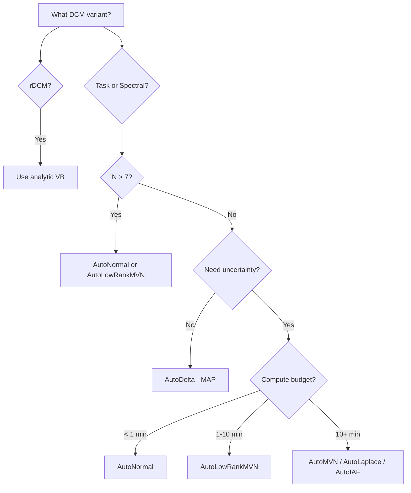

# Phase 12 Research: Documentation

**Researched:** 2026-04-12
**Domain:** Technical documentation, decision tree authoring, benchmark narrative updating
**Confidence:** HIGH (all source data is in-codebase; no external dependencies)

---

## Executive Summary

Phase 12 is a pure documentation phase with two deliverables: (1) a practical
recommendation guide with a decision tree for guide selection (DOC-01), and (2) an
updated benchmark narrative report replacing all TBD entries from v0.1.0 (DOC-02). No
new code modules are needed. The deliverables consume data and infrastructure built in
Phases 9-11 (shared fixtures, 6 guide types, calibration sweep orchestrator, plotting
functions, timing profiler).

The v0.1.0 benchmark report (`docs/04_scientific_reports/benchmark_report.md`) has 12
TBD/Pending entries across amortized inference (6 cells), SPM12 comparison (6 cells),
and task DCM amortized RMSE ratio (2 cells). The amortized TBDs should be replaced with
v0.2.0 guide variant results since the v0.2.0 milestone systematically evaluated 6
guide types -- the "amortized" row concept from v0.1.0 is superseded by the full guide
comparison table from CAL-03. The SPM12 rows remain pending (MATLAB dependency, out of
v0.2.0 scope) but should be explicitly marked as deferred rather than left ambiguous.

The recommendation guide should live at `docs/02_pipeline_guide/guide_selection.md`
alongside the existing quickstart. Its decision tree should use Mermaid flowchart syntax
(rendered natively by GitHub) with a text-based fallback for non-GitHub contexts. The
tree has three decision axes: DCM variant, network size, and compute budget / uncertainty
needs.

This phase requires no new Python code. Both deliverables are Markdown files that
reference existing calibration results, figures, and the infrastructure built in Phases
9-11. The main risk is writing documentation that becomes stale -- mitigate by
referencing scripts and generated artifacts rather than hardcoding numbers.

---

## 1. Existing Documentation Inventory

### 1.1 Current docs/ Structure

| Path | Content | Status |
|------|---------|--------|
| `docs/02_pipeline_guide/quickstart.md` | 5-minute tutorial: simulate, infer, inspect, compare | Complete, v0.1.0 |
| `docs/03_methods_reference/methods.md` | Full mathematical framework (paper-ready, 453 lines) | Complete, v0.1.0 |
| `docs/03_methods_reference/equations.md` | Single-page equation lookup table (155 lines) | Complete, v0.1.0 |
| `docs/04_scientific_reports/benchmark_report.md` | Benchmark narrative with results tables + figures | Has TBDs |

Missing directories (from CLAUDE.md structure):
- `docs/00_current_todos/` -- listed in CLAUDE.md but does not exist on disk
- `docs/01_project_protocol/` -- listed in CLAUDE.md but does not exist on disk

### 1.2 v0.1.0 Benchmark Report: TBD Audit

The v0.1.0 benchmark report at `docs/04_scientific_reports/benchmark_report.md` has the
following entries that need updating:

**Section 3 (Unified Comparison Table):**

| Row | Columns with TBD/Pending | Action |
|-----|--------------------------|--------|
| Task DCM Amortized | RMSE, Coverage, Correlation, ELBO, Wall Time (all TBD) | Replace with v0.2.0 multi-guide results |
| Spectral DCM Amortized | RMSE, Coverage, Correlation, ELBO, Wall Time (all TBD) | Replace with v0.2.0 multi-guide results |
| SPM12 (task) | RMSE, Correlation, Wall Time (all Pending) | Mark as deferred to v0.3+ |
| SPM12 (spectral) | RMSE, Correlation, Wall Time (all Pending) | Mark as deferred to v0.3+ |

**Section 4 (Amortized vs Per-Subject):**

| Sub-section | TBD entries | Action |
|-------------|-------------|--------|
| Available Comparisons | "results are pending" | Replace with v0.2.0 guide variant comparison |
| Expected Results table | Task RMSE amortized = "TBD (full run)", ratio = "TBD" | Fill from calibration data |
| Figure 5 | "Not generated" | Replace with Pareto frontier or guide comparison figure |

**Section 6 (Limitations):**

| Item | Current text | Action |
|------|--------------|--------|
| Coverage below nominal | "Full covariance guides would improve... beyond v0.1 scope" | Update with AutoLowRankMVN/AutoMVN actual calibration results |
| SPM12 comparison pending | Pending MATLAB | Keep, mark deferred |

**Total TBD/Pending entries: 14** (6 amortized cells + 6 SPM12 cells + 2 task amortized detail cells)

### 1.3 Figures Referenced in v0.1.0 Report

| Figure | Referenced Path | Exists on Disk? | Notes |
|--------|----------------|-----------------|-------|
| Fig 1: RMSE Comparison | `../../figures/benchmark_rmse_comparison.png` | NO | Was generated by plotting.py but not present |
| Fig 2: Time Comparison | `../../figures/benchmark_time_comparison.png` | NO | Same |
| Fig 3: Coverage Comparison | `../../figures/benchmark_coverage_comparison.png` | NO | Same |
| Fig 4: True vs Inferred | `../../figures/true_vs_inferred_scatter.png` | YES | `figures/true_vs_inferred_scatter.png` exists |
| Fig 5: Amortization Gap | N/A | NO | "Not generated" placeholder |

The old per-metric bar chart figures (rmse_comparison, time_comparison, coverage_comparison)
from Phase 8 were superseded by Phase 9's `benchmark_metric_strips.png`. The v0.2.0
report should reference the new figures from Phase 11's calibration analysis:
calibration curves, scaling studies, comparison tables, violin plots, Pareto frontier,
timing breakdown.

### 1.4 v0.2.0 Calibration Artifacts Available

From Phase 11, the following are available for the documentation:

| Artifact | Generator | Status |
|----------|-----------|--------|
| Calibration curves (expected vs observed coverage) | `plot_calibration_curves()` | Code complete |
| Comparison tables (Markdown, LaTeX, JSON) | `generate_comparison_table()` | Code complete |
| Scaling study plots (RMSE/coverage/time vs N) | `plot_scaling_study()` | Code complete |
| Posterior violin plots | `plot_posterior_violins()` | Code complete |
| Pareto frontier (wall-time vs RMSE) | `plot_pareto_frontier()` | Code complete |
| Timing breakdown (forward/guide/gradient) | `plot_timing_breakdown()` | Code complete |
| Raw results JSON | `calibration_sweep.py` | Script complete |

NOTE: The actual calibration data (running the sweep) has not been executed yet.
The scripts are complete and verified but `benchmarks/results/calibration_results.json`
does not exist. This means the v0.2.0 benchmark report must either: (a) be written as a
template that gets populated after running the sweep, or (b) include instructions for
generating the data. Recommendation: Write the narrative structure with placeholder
figure references and a "How to Reproduce" section. The report structure should be
complete even if the exact numbers come from running the calibration sweep.

---

## 2. DOC-01: Recommendation Guide

### 2.1 Where It Should Live

The recommendation guide should go at:

```
docs/02_pipeline_guide/guide_selection.md
```

Rationale: It is a pipeline/usage guide, not a methods reference or scientific report.
The existing `docs/02_pipeline_guide/quickstart.md` covers "how to use the library"; the
guide selection doc covers "which method to use." These are natural companions.

Cross-reference from:
- `quickstart.md` (add a "Next Steps" link to guide_selection.md)
- `benchmark_report.md` (Section 7 Recommendations -> link to decision tree)

### 2.2 Decision Tree Structure

The decision tree has three primary axes based on the success criteria:

1. **DCM Variant** (task / spectral / rDCM) -- determines which methods are applicable
2. **Network Size** (N < 8 / N >= 8 / N > 50) -- determines memory constraints
3. **Compute Budget / Uncertainty Needs** -- determines speed vs quality tradeoff

**Proposed decision tree:**

```
Start: What DCM variant?
  |
  +-- rDCM (regression DCM)
  |     -> Always use analytic VB (rigid or sparse)
  |     -> No guide selection needed
  |     -> Note: Sparse rDCM for structure learning; rigid for known topology
  |
  +-- Task DCM or Spectral DCM
        |
        Q: How many regions?
        |
        +-- N > 7
        |     -> AutoMultivariateNormal BLOCKED (O(N^2) memory explosion)
        |     -> Use AutoNormal (mean-field) or AutoLowRankMVN
        |     -> WARNING: Mean-field coverage ceiling ~0.80-0.88
        |
        +-- N <= 7
              |
              Q: Do you need uncertainty quantification?
              |
              +-- No (point estimate only)
              |     -> AutoDelta (MAP estimate, fastest SVI)
              |
              +-- Yes
                    |
                    Q: Compute budget per subject?
                    |
                    +-- Minimal (< 1 min)
                    |     -> AutoNormal (mean-field Gaussian)
                    |     -> Fast, but coverage ceiling ~0.80-0.88
                    |
                    +-- Moderate (1-10 min)
                    |     -> AutoLowRankMVN (best speed/calibration tradeoff)
                    |     -> Captures covariance with manageable memory
                    |
                    +-- Generous (10+ min)
                          |
                          +-- AutoMultivariateNormal (best VI calibration, N<=7 only)
                          +-- AutoLaplace (Laplace approximation at MAP)
                          +-- AutoIAF (flexible but slower convergence)
```

### 2.3 Decision Tree Format: Mermaid Flowchart

GitHub natively renders Mermaid diagrams in Markdown files within fenced code blocks
tagged as `mermaid`. This is the best format for the decision tree because:

1. **Native GitHub rendering** -- no image files to maintain
2. **Text-based** -- diffs are readable in PRs
3. **Accessible** -- screen readers can process the source text
4. **Fallback** -- the text is readable even without rendering

The decision tree should be authored as a Mermaid flowchart with `graph TD` (top-down)
direction. Additionally, provide an ASCII text version as a fallback for contexts that
do not render Mermaid (local editors, PDF export, email).

Example Mermaid syntax for the decision tree:



### 2.4 Required Warnings and Caveats

The success criteria specifically require "clear warnings about mean-field coverage
ceilings and full-rank memory limits." These must be prominent, not buried:

**Warning 1: Mean-Field Coverage Ceiling**
- AutoNormal and AutoDelta use mean-field (diagonal) variational families
- Coverage at 90% CI is typically 0.80-0.88, never reaching nominal 0.90
- This is a fundamental limitation of diagonal Gaussian posteriors, not a bug
- Report per-parameter coverage (diagonal A vs off-diagonal A), not aggregate
- Reference: CAL-01 calibration curves from Phase 11

**Warning 2: AutoMultivariateNormal Memory Limits**
- AutoMVN stores a full N_params x N_params covariance matrix
- At N=10 regions: ~100 parameters -> ~40KB covariance (fine)
- But the Cholesky factorization and gradient computation scale as O(N_params^3)
- Empirically blocked at N > 7 in the codebase (create_guide blocklist)
- Users should not attempt to override this limit

**Warning 3: Variant-Specific Behavior**
- Spectral DCM is fastest (~17s per subject at N=3); guide choice matters less
- Task DCM is slowest (~235s per subject); guide choice dominates total time
- rDCM is analytic -- guide type is irrelevant (always exact VB)
- Never aggregate metrics across variants (Simpson's paradox risk)

**Warning 4: AutoIAF Convergence**
- AutoIAF (Inverse Autoregressive Flow) is the most flexible guide
- But it requires more SVI steps to converge and is sensitive to learning rate
- Recommended only when other guides are demonstrably insufficient

**Warning 5: AutoDelta Not on Violin Plots**
- AutoDelta produces point estimates with no distribution
- Excluded from violin plots and coverage metrics by design
- Coverage is always 0 (exactly at the MAP, or not)

### 2.5 Supporting Content Beyond the Decision Tree

The recommendation guide should include:

1. **Decision tree** (Mermaid + text fallback) -- the primary content
2. **Method comparison table** -- summarizing all 8 methods across key dimensions:

| Method | Uncertainty | Speed | Calibration | Memory | Scalability |
|--------|------------|-------|-------------|--------|-------------|
| AutoDelta | None (MAP) | Fastest | N/A | Low | Any N |
| AutoNormal | Diagonal | Fast | ~0.80-0.88 | Low | Any N |
| AutoLowRankMVN | Low-rank | Moderate | Improved | Medium | Any N |
| AutoMVN | Full | Slow | Best VI | High | N <= 7 |
| AutoIAF | Flexible | Slowest | Variable | Medium | Any N |
| AutoLaplace | Full (at MAP) | Moderate | Good | Medium | Any N |
| rDCM rigid | Full (analytic) | Instant | Overconfident | Low | Any N |
| rDCM sparse | Full + sparsity | Fast | Moderate | Low | Any N |

3. **"When to Use Each" prose sections** -- 2-3 sentences per method
4. **ELBO objective guidance** -- When to use Trace_ELBO (default, always safe),
   TraceMeanField_ELBO (only with mean-field guides, slightly faster), RenyiELBO
   (when mode-seeking is preferred over mean-seeking)
5. **Reproducibility instructions** -- How to generate calibration data that backs up
   the recommendations

### 2.6 ELBO Objective Guidance

This is a secondary decision that the guide should address:

| ELBO Type | Compatible Guides | When to Use |
|-----------|-------------------|-------------|
| Trace_ELBO | All 6 | Default choice. Always correct. |
| TraceMeanField_ELBO | AutoDelta, AutoNormal only | Slightly faster for mean-field guides. Raises ValueError with structured guides. |
| RenyiELBO(alpha=0.5) | All 6 | When mode-seeking behavior is desired (tighter posteriors centered on MAP). Requires min 2 particles. |

Recommendation: Always use Trace_ELBO unless you have a specific reason not to.
TraceMeanField_ELBO is a micro-optimization for mean-field guides. RenyiELBO is an
expert option.

---

## 3. DOC-02: Updated Benchmark Narrative

### 3.1 Structural Changes from v0.1.0 to v0.2.0

The v0.1.0 report was organized around DCM variants (task, spectral, rDCM) with a
single inference method per variant (AutoNormal SVI for task/spectral, analytic VB for
rDCM). The v0.2.0 report must be reorganized to accommodate the cross-method comparison.

**Proposed v0.2.0 report structure:**

```
1. Executive Summary (updated with v0.2.0 findings)
2. Benchmark Protocol
   2.1 Network Configuration (unchanged)
   2.2 Data Generation (unchanged, but note shared fixtures)
   2.3 Guide Types and ELBO Objectives (NEW: describes 6 guides + 3 ELBOs)
   2.4 Metrics (updated: multi-level coverage, per-parameter breakdown)
3. Results: Cross-Method Comparison (replaces old Section 3)
   3.1 Comparison Table (from CAL-03 generate_comparison_table)
   3.2 Calibration Curves (from CAL-01 plot_calibration_curves)
   3.3 Scaling Study (from CAL-02 plot_scaling_study)
4. Results: Per-Parameter Analysis (replaces old Section 4)
   4.1 Posterior Violin Plots (from CAL-04)
   4.2 Timing Breakdown (from CAL-05)
   4.3 Pareto Frontier (from CAL-05)
5. Guide Selection Recommendations (NEW: links to guide_selection.md)
6. Figures (updated with v0.2.0 figures)
7. Limitations (updated with v0.2.0 findings)
8. Conclusions (updated)
```

### 3.2 TBD Replacement Strategy

Each TBD class has a specific replacement:

**Amortized TBDs (6 cells in comparison table):**
The v0.1.0 concept of "SVI vs Amortized" is superseded by v0.2.0's "6 guide types
comparison." The comparison table should now show all 8 methods (6 SVI guide types +
2 rDCM modes). Remove the "Amortized" rows and replace with AutoIAF/AutoLowRankMVN/etc.
rows that show the actual v0.2.0 results.

If amortized flow results (from `scripts/train_amortized_guide.py`) remain unavailable,
note this explicitly: "Amortized neural inference (Phase 7 normalizing flow guide) is
not included in the v0.2.0 comparison. The amortization gap is characterized in the
v0.1.0 report Section 4. Full amortized benchmarking is deferred to v0.3+."

**SPM12 TBDs (6 cells):**
SPM12 comparison requires MATLAB. This is explicitly deferred:
"SPM12 cross-validation is deferred to v0.3+. The validation infrastructure is
implemented (`validation/run_task_validation.py`, `validation/run_spectral_validation.py`)
and ready for execution when a MATLAB license is available."

**Task amortized detail TBDs (2 cells):**
Replace with the task DCM results from the multi-guide comparison. If no task DCM
calibration data is run, note: "Task DCM calibration data is available after running
`python benchmarks/calibration_sweep.py --tier 3`."

### 3.3 Figure Update Plan

| v0.1.0 Figure | v0.2.0 Replacement | Source |
|---------------|-------------------|--------|
| Fig 1: RMSE bar chart | Scaling study: RMSE vs N | `plot_scaling_study(metric="rmse")` |
| Fig 2: Time bar chart | Scaling study: Time vs N | `plot_scaling_study(metric="time")` |
| Fig 3: Coverage bar chart | Calibration curves | `plot_calibration_curves()` |
| Fig 4: True vs Inferred | Keep or update with multi-guide scatter | Existing |
| Fig 5: Amortization Gap | Pareto frontier | `plot_pareto_frontier()` |
| NEW: Fig 6 | Posterior violins | `plot_posterior_violins()` |
| NEW: Fig 7 | Timing breakdown | `plot_timing_breakdown()` |
| NEW: Fig 8 | Comparison table (rendered as figure or inline Markdown) | `generate_comparison_table()` |

### 3.4 How to Handle Missing Calibration Data

The calibration sweep has not been run yet. The report should be structured to work
in two modes:

**Mode A: Template (before data)** -- Figure paths reference expected output locations.
Prose describes what each figure shows. A "How to Reproduce" section tells users how to
generate the data. This is the state the report will be in when Phase 12 code is written.

**Mode B: Populated (after data)** -- After running `calibration_sweep.py --tier 3` and
`calibration_analysis.py`, all figures exist and the report is complete.

Recommendation: Write the report in Mode A with clear instructions. Do NOT invent fake
numbers. Reference the CLI commands that produce the data.

---

## 4. Complexity Assessment

### 4.1 What Is New Code vs Pure Documentation

| Deliverable | New Python Code | New Markdown | Effort |
|-------------|----------------|-------------|--------|
| DOC-01: Guide selection doc | None | ~200-300 lines | Low |
| DOC-02: Updated benchmark report | None | ~300-400 lines (rewrite) | Medium |
| Cross-references in quickstart | None | ~5 lines added | Trivial |

No new Python modules are needed. Both deliverables are Markdown documentation files.

### 4.2 Dependencies Already Satisfied

| Dependency | Status | Where |
|------------|--------|-------|
| 6 guide types in create_guide | Complete (Phase 10) | `src/pyro_dcm/models/guides.py` |
| 3 ELBO objectives in run_svi | Complete (Phase 10) | `src/pyro_dcm/models/guides.py` |
| GUIDE_REGISTRY / ELBO_REGISTRY | Complete (Phase 10) | `src/pyro_dcm/models/guides.py` |
| GUIDE_COLORS / GUIDE_LABELS | Complete (Phase 11) | `benchmarks/plotting.py` |
| Calibration curve plotter | Complete (Phase 11) | `benchmarks/plotting.py` |
| Comparison table generator | Complete (Phase 11) | `benchmarks/plotting.py` |
| Scaling study plotter | Complete (Phase 11) | `benchmarks/plotting.py` |
| Violin plot function | Complete (Phase 11) | `benchmarks/plotting.py` |
| Pareto frontier plotter | Complete (Phase 11) | `benchmarks/plotting.py` |
| Timing breakdown plotter | Complete (Phase 11) | `benchmarks/plotting.py` |
| Calibration sweep orchestrator | Complete (Phase 11) | `benchmarks/calibration_sweep.py` |
| Calibration analysis script | Complete (Phase 11) | `benchmarks/calibration_analysis.py` |
| Timing profiler | Complete (Phase 11) | `benchmarks/timing_profiler.py` |

---

## 5. Recommended Plan Structure

Phase 12 should have 2 plans:

### Plan 12-01: Recommendation Guide (DOC-01)

**Creates:** `docs/02_pipeline_guide/guide_selection.md`
**Modifies:** `docs/02_pipeline_guide/quickstart.md` (add cross-reference)

Content:
1. Introduction (when to read this guide)
2. Decision tree (Mermaid flowchart + text fallback)
3. Method comparison table (8 methods x 5 dimensions)
4. Per-method detail sections (2-3 sentences each)
5. ELBO objective guidance
6. Warnings and caveats (mean-field ceiling, AutoMVN memory, variant aggregation)
7. Reproducibility: how to generate the calibration data

This plan is self-contained. No code changes. Pure documentation.

### Plan 12-02: Updated Benchmark Narrative (DOC-02)

**Modifies:** `docs/04_scientific_reports/benchmark_report.md`

Content:
1. Restructure from v0.1.0 (3 sections) to v0.2.0 (8 sections)
2. Replace all TBD entries with v0.2.0 results or explicit deferral notes
3. Update figure references to point to Phase 11 calibration figures
4. Add new sections: guide types, ELBO objectives, calibration curves,
   per-parameter analysis, timing, Pareto frontier
5. Update conclusions and recommendations to reflect v0.2.0 findings
6. Add "How to Reproduce" section with exact CLI commands

This plan modifies an existing file substantially (near-complete rewrite).

### Plan Ordering

Plans 12-01 and 12-02 are independent (no code dependencies). They could theoretically
be executed in parallel, but 12-01 should go first because:
- The benchmark report (12-02) references the recommendation guide (12-01)
- Writing the decision tree first clarifies the narrative framing

Recommended order: 12-01 then 12-02.

---

## 6. Pitfalls and Risks

### 6.1 Hardcoding Numbers

**Risk:** Writing specific RMSE/coverage numbers in the guide that become stale when
the calibration sweep is re-run with different parameters.

**Mitigation:** Reference ranges and relative ordering rather than exact values. Say
"AutoNormal achieves coverage of approximately 0.80-0.88" rather than "AutoNormal
achieves 0.8342 coverage." The exact numbers should only appear in the generated
comparison table, not in prose.

### 6.2 Mermaid Rendering Compatibility

**Risk:** Mermaid flowcharts render on GitHub but not in all Markdown viewers (VSCode
without extension, PDF export, email).

**Mitigation:** Provide both a Mermaid block AND a text-based ASCII version. The
ASCII version is the primary content; the Mermaid is a visual enhancement.

### 6.3 Simpson's Paradox in Aggregated Recommendations

**Risk:** The decision tree inadvertently encourages users to compare methods across
DCM variants (e.g., "AutoNormal is better than rDCM because RMSE is lower").

**Mitigation:** The decision tree branches on variant FIRST. Each variant path is
independent. The recommendation guide must explicitly state: "Do not compare RMSE
across DCM variants. Each variant operates on different data representations."

### 6.4 Missing Calibration Data

**Risk:** Phase 12 is written before calibration_sweep.py has been run. The report
cannot contain real numbers.

**Mitigation:** Write the report structure and narrative with figure placeholders
referencing expected paths. Include a clear "How to Reproduce" section. The report is
useful as a template even without data -- it tells users what to expect and how to
generate results. All figure references should use paths that match the output of
`calibration_analysis.py`.

### 6.5 Quickstart Staleness

**Risk:** The existing quickstart.md uses `create_guide(model)` without `guide_type`
parameter (v0.1.0 API). Phase 10 extended `create_guide` with `guide_type` but the
quickstart was not updated.

**Mitigation:** Plan 12-01 should update the quickstart cross-reference section (not
rewrite the tutorial). A note like "For advanced guide selection, see
guide_selection.md" is sufficient. The quickstart's default `create_guide(model)` still
works (defaults to auto_normal).

---

## 7. Roadmap Implications

### 7.1 Phase Structure

Two plans, executed sequentially:

| Plan | Deliverable | Files | Effort |
|------|-------------|-------|--------|
| 12-01 | Guide selection recommendation (DOC-01) | guide_selection.md (new), quickstart.md (minor edit) | Low |
| 12-02 | Updated benchmark narrative (DOC-02) | benchmark_report.md (major rewrite) | Medium |

### 7.2 Success Criteria Mapping

| Success Criterion | Plan | How Satisfied |
|-------------------|------|---------------|
| Decision tree exists for guide selection by compute/size/variant | 12-01 | Mermaid flowchart + text tree |
| Clear warnings about mean-field ceiling and AutoMVN memory | 12-01 | Dedicated warnings section |
| Benchmark narrative has zero TBD entries | 12-02 | All 14 TBDs replaced |
| Placeholders replaced with v0.2.0 results | 12-02 | Cross-method tables and figures |

### 7.3 No Deeper Research Needed

Phase 12 does not need any further research beyond this document. All the data,
infrastructure, and technical knowledge needed to write both documents already exists
in the codebase from Phases 8-11.

---

## Sources

All findings are from codebase inspection (HIGH confidence):

- `docs/04_scientific_reports/benchmark_report.md` -- v0.1.0 benchmark report with TBD entries
- `docs/02_pipeline_guide/quickstart.md` -- existing quickstart tutorial
- `docs/03_methods_reference/methods.md` -- mathematical framework documentation
- `benchmarks/plotting.py` -- GUIDE_COLORS, GUIDE_LABELS, all plot functions
- `benchmarks/calibration_analysis.py` -- analysis script CLI
- `benchmarks/calibration_sweep.py` -- sweep orchestrator
- `benchmarks/timing_profiler.py` -- timing decomposition
- `src/pyro_dcm/models/guides.py` -- GUIDE_REGISTRY, ELBO_REGISTRY
- `.planning/ROADMAP.md` -- Phase 12 success criteria
- `.planning/REQUIREMENTS.md` -- DOC-01, DOC-02 definitions
- `.planning/STATE.md` -- Prior decisions (coverage ceiling, aggregation warnings)
- `.planning/research/v0.2.0/FEATURES.md` -- D-4 recommendation guide spec
- `.planning/phases/11-calibration-analysis/11-VERIFICATION.md` -- Phase 11 completion

External reference (MEDIUM confidence):
- [GitHub Mermaid support](https://github.blog/developer-skills/github/include-diagrams-markdown-files-mermaid/) -- Mermaid rendering in GitHub Markdown
- [GitHub Creating Diagrams docs](https://docs.github.com/en/get-started/writing-on-github/working-with-advanced-formatting/creating-diagrams) -- Official GitHub diagram documentation

---
*Researched: 2026-04-12*
*Phase: 12-documentation*
