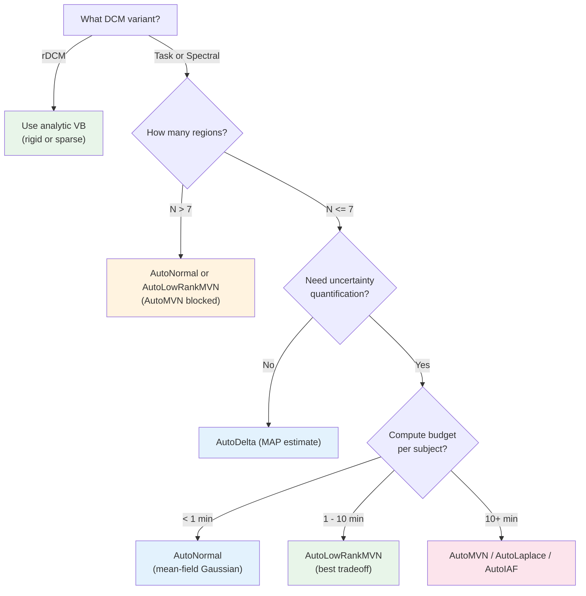

# Guide Selection: Choosing a Variational Guide for Pyro-DCM

This guide helps you choose the right variational inference method for your
DCM analysis. It covers the six SVI guide types available through
`GUIDE_REGISTRY` and the two analytic rDCM modes.

**Prerequisite:** Familiarity with Pyro-DCM basics. See
[quickstart.md](quickstart.md) for a 5-minute tutorial covering simulation,
inference, and model comparison.

**Scope:** All 8 inference methods supported in Pyro-DCM v0.2.0.

---

## Quick Decision Tree

The following flowchart selects a guide based on three axes: DCM variant,
network size, and compute budget.



### Text Fallback

For contexts that do not render Mermaid (local editors, PDF export):

```
What DCM variant?
|
+-- rDCM (regression DCM)
|     --> Use analytic VB (rigid or sparse)
|         - rigid: known topology, fastest
|         - sparse: structure learning via ARD
|
+-- Task DCM or Spectral DCM
      |
      How many regions (N)?
      |
      +-- N > 7
      |     --> AutoNormal or AutoLowRankMVN
      |         (AutoMVN is blocked due to memory explosion)
      |
      +-- N <= 7
            |
            Need uncertainty quantification?
            |
            +-- No (point estimate only)
            |     --> AutoDelta (MAP estimate, fastest)
            |
            +-- Yes
                  |
                  Compute budget per subject?
                  |
                  +-- < 1 min
                  |     --> AutoNormal (mean-field Gaussian)
                  |
                  +-- 1 - 10 min
                  |     --> AutoLowRankMVN (best speed/calibration tradeoff)
                  |
                  +-- 10+ min
                        --> AutoMVN (best VI calibration, N <= 7 only)
                        --> AutoLaplace (Laplace approximation at MAP)
                        --> AutoIAF (flexible flow, slower convergence)
```

---

## Method Comparison Table

| Method | `guide_type` key | Uncertainty | Speed | Calibration (90% CI) | Scalability |
|---|---|---|---|---|---|
| AutoDelta | `auto_delta` | None (MAP) | Fastest | N/A (point estimate) | Any N |
| AutoNormal | `auto_normal` | Diagonal Gaussian | Fast | ~0.80--0.88 | Any N |
| AutoLowRankMVN | `auto_lowrank_mvn` | Low-rank covariance | Moderate | Improved over mean-field | Any N |
| AutoMVN | `auto_mvn` | Full covariance | Slow | Best VI calibration | N <= 7 |
| AutoIAF | `auto_iaf` | Flexible (flow) | Slowest | Variable | Any N |
| AutoLaplace | `auto_laplace` | Full covariance (at MAP) | Moderate | Good | Any N |
| rDCM (rigid) | N/A (analytic) | Full (analytic VB) | Instant | Overconfident (~0.44) | Any N |
| rDCM (sparse) | N/A (analytic) | Full + sparsity (ARD) | Fast | Moderate (~0.53) | Any N |

Notes on reading this table:

- **Calibration** shows approximate coverage at the nominal 90% credible interval.
  Perfect calibration would yield 0.90. Values below 0.90 indicate overconfidence.
- **Speed** is relative within each DCM variant. Spectral DCM is inherently faster
  than task DCM for the same guide type.
- Do not compare calibration or RMSE across DCM variants (see Warning 3 below).

---

## When to Use Each Method

### AutoDelta

Use `auto_delta` when you only need point estimates and want the fastest possible
convergence. AutoDelta performs MAP estimation via SVI, which is useful for quick
model comparison (ELBO ranking) when uncertainty quantification is not required.
It produces no posterior distribution, so coverage metrics do not apply.

### AutoNormal

Use `auto_normal` as the default choice for most analyses. It fits an independent
(diagonal) Gaussian to each latent variable, providing both point estimates and
uncertainty intervals. Coverage at 90% CI is typically 0.80--0.88 due to the
fundamental limitation of diagonal posteriors that ignore parameter correlations.

### AutoLowRankMVN

Use `auto_lowrank_mvn` when you need better calibration than AutoNormal without
the memory cost of a full covariance matrix. It captures the dominant posterior
correlations through a low-rank-plus-diagonal parameterization (default rank 2).
This is the recommended tradeoff between speed and calibration quality.

### AutoMVN

Use `auto_mvn` when you need the best possible VI calibration and your network
has N <= 7 regions. AutoMVN fits a full multivariate Gaussian, capturing all
pairwise posterior correlations. It is blocked at N > 7 in `create_guide` because
gradient computation scales as O(N_params^3) and causes memory explosion.

### AutoIAF

Use `auto_iaf` when other guide types are demonstrably insufficient and you need a
more flexible variational family. AutoIAF uses inverse autoregressive flows to
model complex posterior geometries. It requires more SVI steps and careful learning
rate tuning. The `hidden_dim` and `num_transforms` parameters control expressivity.

### AutoLaplace

Use `auto_laplace` when you want a full covariance estimate without running SVI for
the covariance parameters. AutoLaplace first finds the MAP estimate via SVI, then
computes the Hessian at the MAP to produce an `AutoMultivariateNormal` guide. The
returned `result["guide"]` from `run_svi` is the post-Laplace MVN guide.

### rDCM (rigid)

Use rigid rDCM for regression DCM with a known network topology. Inference is
analytic (closed-form VB), so no guide selection or SVI is needed. Posteriors tend
to be overconfident (coverage ~0.44 at 90% CI) because the analytic approximation
does not capture all sources of uncertainty.

### rDCM (sparse)

Use sparse rDCM when you want automatic structure learning via automatic relevance
determination (ARD). Like rigid rDCM, inference is analytic and instant. ARD priors
prune unnecessary connections, which can improve both model parsimony and calibration
(coverage ~0.53 at 90% CI, better than rigid but still below nominal).

---

## ELBO Objective Guidance

The ELBO objective controls how the variational bound is estimated during SVI.
Three options are available through `ELBO_REGISTRY`:

| ELBO Type | `elbo_type` key | Compatible Guides | When to Use |
|---|---|---|---|
| Trace ELBO | `trace_elbo` | All 6 SVI guides | Default. Always correct. |
| TraceMeanField ELBO | `tracemeanfield_elbo` | `auto_delta`, `auto_normal` only | Micro-optimization for mean-field guides. |
| Renyi ELBO | `renyi_elbo` | All 6 SVI guides | Mode-seeking (alpha=0.5). Requires min 2 particles. |

**Recommendation:** Always use `trace_elbo` unless you have a specific reason not to.

- `tracemeanfield_elbo` exploits the factorized structure of mean-field guides for a
  modest speed improvement, but raises `ValueError` if used with structured guides
  (`auto_lowrank_mvn`, `auto_mvn`, `auto_iaf`, `auto_laplace`).
- `renyi_elbo` (alpha=0.5) produces mode-seeking behavior, yielding tighter posteriors
  centered closer to the MAP. It requires `num_particles >= 2` (enforced automatically
  by `run_svi`). This is an expert option for when Trace ELBO yields overly diffuse
  posteriors.

Example usage:

```python
from pyro_dcm.models.guides import create_guide, run_svi
from pyro_dcm.models.task_dcm_model import task_dcm_model

guide = create_guide(task_dcm_model, guide_type="auto_lowrank_mvn")
result = run_svi(
    task_dcm_model,
    guide,
    model_args,
    num_steps=2000,
    elbo_type="trace_elbo",       # default, always safe
    guide_type="auto_lowrank_mvn",  # enables validation
)
```

---

## Warnings and Caveats

> **Warning: Mean-field coverage ceiling (~0.80--0.88).**
>
> AutoNormal uses a diagonal Gaussian that ignores posterior correlations between
> parameters. This is a fundamental limitation, not a bug. Coverage at the nominal
> 90% credible interval typically reaches only 0.80--0.88. When reporting results,
> break down coverage per parameter type (diagonal A elements vs off-diagonal A
> elements) rather than reporting a single aggregate number. Off-diagonal elements
> often have worse coverage than diagonal self-inhibition parameters.

> **Warning: AutoMVN memory limit (N > 7 blocked).**
>
> `AutoMultivariateNormal` stores and differentiates through a full N_params x
> N_params covariance matrix. Gradient computation scales as O(N_params^3). At
> N = 10 regions the parameter count grows quadratically and Cholesky factorization
> becomes prohibitively expensive. The `create_guide` function enforces a hard block
> at N > 7 (configured in `_MAX_REGIONS`). Use `auto_lowrank_mvn` instead for
> larger networks. Do not attempt to override this limit.

> **Warning: Variant-specific behavior -- do not aggregate across DCM variants.**
>
> Spectral DCM is the fastest variant (~17s per subject at N=3). Task DCM is the
> slowest (~235s per subject). rDCM is analytic and effectively instant. RMSE values
> are not comparable across variants because each operates on different data
> representations (BOLD time series vs cross-spectral density vs frequency-domain
> regressors). Aggregating metrics across variants produces Simpson's paradox
> artifacts. Always report results per variant.

> **Warning: AutoIAF convergence sensitivity.**
>
> AutoIAF (Inverse Autoregressive Flow) is the most expressive guide type but also
> the most difficult to train. It requires more SVI steps than other guides and is
> sensitive to learning rate, `hidden_dim`, and `num_transforms` settings. Use
> AutoIAF only when simpler guides are demonstrably insufficient for your analysis.
> Start with the defaults (`hidden_dim=[20]`, `num_transforms=2`) and increase
> `num_steps` before changing architecture parameters.

> **Warning: AutoDelta exclusion from coverage and violin metrics.**
>
> AutoDelta produces point estimates (MAP) with no posterior distribution. It is
> excluded from coverage calculations and posterior violin plots by design. If you
> need uncertainty quantification, use any other guide type. AutoDelta is included
> in RMSE comparisons and ELBO-based model ranking.

---

## Reproducing the Calibration Data

The recommendations in this guide are based on systematic calibration sweeps across
all guide types, DCM variants, and network sizes. To reproduce the underlying data:

**Quick smoke test (tier 1, ~5 minutes):**

```bash
python benchmarks/calibration_sweep.py --tier 1
```

**Moderate sweep (tier 2, ~30 minutes):**

```bash
python benchmarks/calibration_sweep.py --tier 2
```

**Full benchmark (tier 3, ~2 hours):**

```bash
python benchmarks/calibration_sweep.py --tier 3
```

After generating results, produce figures and comparison tables:

```bash
python benchmarks/calibration_analysis.py \
    --results-path benchmarks/results/calibration_results.json \
    --output-dir benchmarks/figures
```

The analysis script generates calibration curves, scaling study plots, posterior
violin plots, Pareto frontiers, timing breakdowns, and comparison tables in both
Markdown and LaTeX formats. See `benchmarks/figures/` for output.

**Key scripts:**

| Script | Purpose |
|--------|---------|
| `benchmarks/calibration_sweep.py` | Orchestrates recovery experiments across methods, variants, and sizes |
| `benchmarks/calibration_analysis.py` | Generates figures and tables from sweep results |
| `benchmarks/timing_profiler.py` | Profiles forward/guide/gradient timing breakdown per guide type |

---

## See Also

- [quickstart.md](quickstart.md) -- 5-minute tutorial for Pyro-DCM
- [methods.md](../03_methods_reference/methods.md) -- Full mathematical framework
- [equations.md](../03_methods_reference/equations.md) -- Equation quick-reference
- [benchmark_report.md](../04_scientific_reports/benchmark_report.md) -- Benchmark
  narrative with results and figures
